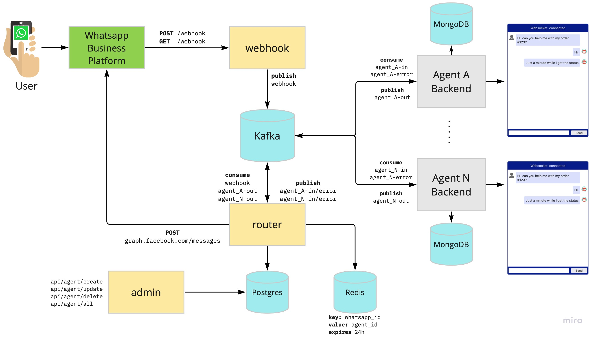

# Golang Whatsapp Broker

This is an Open-Source project with the goal to build a whatsapp broker that connect direct with [Whatsapp Business Platform](https://developers.facebook.com/docs/whatsapp)

## Main goals
<ol> 
<li>Build a webhook to connect with Whatsapp Business Plataform without any 3rd party company. </li>
<li>With one whatsapp business number, be able to connect several agents, for example:</li>
<ul>
    <li>agent to deal with consumer service</li>
    <li>agent to deal with sales</li>
    <li>agent to detal with help desk</li>
    <li>and so on</li>
</ul>
<li> Build a router to route messages from users to agents. </li>
<li> Build a admin service to register agents in the router </li>
<li> Build a demo agent to show how to connect with broker. </li>
<li> Build a simple web interface to simulate an person answering from the given agent. </li>
</ol>

## Tools
Golang: all backend microservices were written in Golang.

Kafka: to stream messages from Whatsapp for the agents.

Redis: to cache the information about who users is connected with a given agent

Postgresql: to store/keep all agents.

MongoDB: used in the demo-app to store the messages from kafka topic in the specifc agent storage.

ReactJS: used to build the simple chatbot interface

## Architecture
